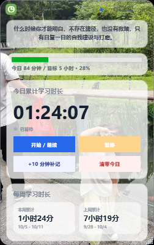
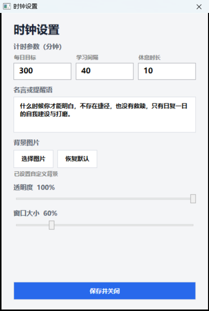

# 终身学习时钟

<p align="center">
  
</p>

<p align="center">
  一款轻量、直观的 Windows 桌面学习时钟。<br>
  记录今天的投入，保持长期而稳定的学习节奏。
</p>

<p align="center">
  <a href="https://github.com/mianwtt/lifelong-learning-clock/releases/download/v1.0.0/Lifelong-Learning-Clock-v1.0.0.exe"><strong>⬇ 下载 Windows 版本 v1.0.0</strong></a>
  ·
  <a href="https://github.com/mianwtt/lifelong-learning-clock/releases/tag/v1.0.0">查看发布说明</a>
</p>

---

## 软件界面

| 主界面 | 设置界面 |
|:---:|:---:|
|  |  |
| 查看当天计时、目标进度及每周统计 | 调整每日目标、学习间隔、休息时长和外观 |

## 功能亮点

- **学习与休息循环**：设置学习间隔与休息时长，到点自动提醒。
- **每日学习目标**：通过进度条直观看到当天完成情况。
- **学习时间统计**：展示今日、本周和上周的学习时长。
- **手动补记时长**：遗漏计时时可快速补记 10 分钟。
- **桌面悬浮显示**：支持置顶、拖动和屏幕边缘吸附。
- **个性化外观**：自定义背景图片、透明度、窗口大小和励志语。
- **本地数据保存**：学习记录和软件设置保存在本机。
- **单实例运行**：避免重复打开多个时钟窗口。

## 下载与运行

推荐从 GitHub Releases 下载：

> **[下载 Lifelong-Learning-Clock-v1.0.0.exe](https://github.com/mianwtt/lifelong-learning-clock/releases/download/v1.0.0/Lifelong-Learning-Clock-v1.0.0.exe)**

仓库中也保留了一份可执行程序：

> [`downloads/Lifelong-Learning-Clock-v1.0.0.exe`](downloads/Lifelong-Learning-Clock-v1.0.0.exe)

下载后双击即可运行，无需安装。

> [!NOTE]
> 当前版本面向 Windows 桌面系统。程序暂未进行数字签名，首次运行时 Windows 可能显示安全提示；请确认下载地址来自本仓库后再运行。

## 使用方法

1. 打开软件，在右上角进入设置。
2. 设置每日目标、学习间隔和休息时长。
3. 点击“开始 / 继续”开始累计学习时间。
4. 学习中断时点击“暂停”，遗漏计时时可使用“+10 分钟补记”。
5. 每周查看本周与上周统计，逐步调整学习节奏。

## 文件校验

发布文件：`Lifelong-Learning-Clock-v1.0.0.exe`

```text
SHA-256: AB9A2FA2023BC830817F3D578CC1ADC47AF903DA8CE6EAC6F79AFB3BFBD7883F
```

在 PowerShell 中核对：

```powershell
Get-FileHash ".\Lifelong-Learning-Clock-v1.0.0.exe" -Algorithm SHA256
```

## 问题反馈

遇到问题请前往 [Issues](https://github.com/mianwtt/lifelong-learning-clock/issues) 提交反馈，并尽量附上：

- Windows 版本
- 软件版本
- 问题描述与复现步骤
- 截图或错误信息

请勿在反馈中上传密码、令牌或其他隐私数据。

## 版权说明

Copyright © 2026. All rights reserved.

当前仓库用于发布可执行程序和使用说明，未附带开源许可证。除法律明确允许的情形外，未经作者许可，不得修改、反编译或再次分发本软件。

